# DuoSign — Text to ASL Gloss: How It Works

```mermaid
flowchart TD
    A([User types or speaks a sentence]) --> B{Voice or Text?}

    B -- Voice --> C[Speech is converted to text\nusing AI voice recognition]
    C --> D
    B -- Text --> D

    D{Seen this sentence before?}
    D -- Yes --> OUT([Return saved translation instantly])
    D -- No --> E

    E{Is this a common idiom?\ne.g. 'break a leg', 'under the weather'}
    E -- Yes --> F[Swap it for its true meaning in ASL\ne.g. 'break a leg' → GOOD LUCK]
    F --> OUT

    E -- No --> G

    subgraph RULES ["  Applying ASL Grammar Rules  "]
        G[Step 1 — Strip small words\nRemove: a, an, the, is, are, was, of, to, for ...]
        G --> H[Step 2 — Simplify each word\nVerbs go to base form: 'running' → RUN\nNouns become singular: 'doctors' → DOCTOR+]
        H --> I[Step 3 — Reorder for ASL\nASL word order is different from English]
        I --> I1[Put time words first\n'Tomorrow I go' → TOMORROW I GO]
        I1 --> I2[Put location words after time\n'At school tomorrow' → TOMORROW SCHOOL]
        I2 --> I3[Put the verb at the end of the action\n'I am searching for a doctor' → I DOCTOR SEARCH]
        I3 --> I4[Put describing words after the noun\n'The big red car' → CAR BIG RED]
        I4 --> I5[Put question words at the end\n'Where is the bathroom?' → BATHROOM WHERE]
        I5 --> I6[Put NOT at the very end\n'She does not like pizza' → SHE PIZZA LIKE NOT]
    end

    I6 --> J{How well does the output\nmatch known ASL signs?}

    J -- "Most words are recognised\n— result looks solid" --> K{Run an AI quality check\nin the background?}
    J -- "Many words not recognised\n— result needs help" --> L

    K -- Skip --> OUT
    K -- Run --> L

    L[Send the sentence to the AI\nThe AI knows ASL grammar rules\nand picks the best available signs]
    L --> M{Did the AI improve the result?}
    M -- Yes --> N[Replace with the AI's better translation]
    M -- No --> OUT
    N --> OUT

    OUT([Return the final ASL Gloss to the user])

    classDef io fill:#4A90D9,stroke:#2C6FAC,color:#fff
    classDef rule fill:#1E3A5F,stroke:#2C6FAC,color:#dce8f5
    classDef decision fill:#7B4FBF,stroke:#5A3A8A,color:#fff
    classDef out fill:#27AE60,stroke:#1A7A42,color:#fff
    classDef ai fill:#C0762A,stroke:#8A4F10,color:#fff

    class A,C io
    class G,H,I,I1,I2,I3,I4,I5,I6 rule
    class B,D,E,J,K,M decision
    class OUT,F out
    class L,N ai
```

---

**The short version:**

The algorithm does to English what a human interpreter would do mentally before signing:

1. **Strip filler words** — ASL doesn't use "a", "the", "is", etc.
2. **Simplify words** — base verb forms, mark plurals
3. **Reorder the sentence** — ASL has its own word order:
   - Time first → Location next → Subject → Object → Verb → NOT last
   - Describing words come *after* the noun, not before
   - Question words go at the *end*, not the beginning
4. **Check confidence** — if the result doesn't line up with known signs, the AI steps in
5. **AI quality pass** — even good results get quietly reviewed by the AI when the network is fast enough
